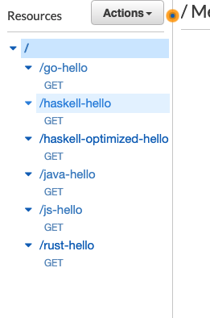
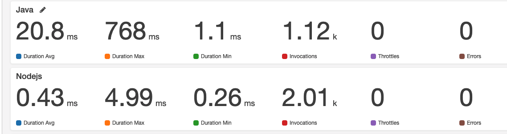

# aws-lambda-benchmark
A project that contains AWS Lambda function implementations for several runtimes e.g. Nodejs, Haskell, Python, Go, Rust, Java, etc.

- [Examples and Performance](#examples)
- [CloudWatch Dashboard Screenshots](#cloudwatch-dashboard-screenshots)
- [Triggering your function through API Gateway](#Triggering-your-function-through-API-Gateway)
- [Using Artillery for testing](#Using-Artillery-for-testing)
- [Creating a Dashboard using AWS CloudWatch](#Creating-a-Dashboard-using-AWS-CloudWatch)

## Examples
[Hello World](examples/hello-world/setup.md)

|**Runtime**|**Best Cold Start**|**Worst Cold Start**|**execution time**|
|-------|---------------|----------------|------------------|
|**Haskell**|132 ms|132 ms|12.50 ms|
|**Java**|790 ms|**801 ms**|0.89 ms|
|**Nodejs**|3.85 ms|4.99 ms| 0.26 ms|
|**Go**|**1.39 ms**|7.60 ms|0.25 ms|
|**Rust**|39.1 ms|39.5 ms|0.70 ms|
|**Python**|15.9 ms|19.8 ms|**0.22 ms**|

### CloudWatch Dashboard Screenshots
**18-06-2019** [Screenshot](assets/performance/hello-world/hello-world-18-06-19.png)
- Improvements in [Lambda Haskell Runtime](https://github.com/theam/aws-lambda-haskell-runtime/pull/29)  

**17-06-2019** [Screenshot](assets/performance/hello-world/hello-world-17-06-19.png)
- Baseline

---

## Triggering your function through API Gateway

First of all, we will need to create a few resources before we can trigger our Lambda Function. Go to `API Gateway` in the AWS Console.

- Create a new API, select `Rest` and from `New API` and choose a name for your API.
- Then create a `stage` named e.g. `dev`
- Create a `resource` named e.g. `nodejs-hello` and enable `CORS`
- Within that resource, create a `method` `GET`, enable `Use Lambda Proxy Integration` and type the name of your function under `Lambda Function`
- Finally click `save` and click `deploy` under the dropdown menu of `Actions`
- Your endpoint URL will be: <Method> <stage-invoke-url>/<resource-name>, e.g. GET https://0c9lfg7004.execute-api.us-east-1.amazonaws.com/dev/nodejs-hello

**If you experience 403 errors when triggering your endpoint, go to `Actions` and click `Deploy API`**

**Note: This API Gateway could be reused for many different Lambda functions by creating a `resource` for each of them**

## Using Artillery for testing

If you don't have artillery install,

`yarn global add artillery`
or
`npm install --global artillery`

### Manual Approach
Run a quick test that will perform 10 rps per second during 10 seconds coming from 10 different sources each second

`artillery quick --duration 10 --rate 10 -n 1 https://0c9lfg7004.execute-api.us-east-1.amazonaws.com/dev/nodejs-hello`

### Automated Approach
Go to the example artillery directory, e.g. `cd examples/hello-world/artillery`

and then run the following command:

`slsart invoke -p artillery-test.yml`

This will trigger a set requests for each of the languages we are currently benchmarking in the `hello-world` example.

## Creating a Dashboard using AWS CloudWatch
AWS CloudWatch is the service where you could find Analytics about your Lambda function. Information about execution time, # invocations, # errors or # throttles. Go to `AWS CloudWatch` in the AWS Console.

- Click on `Dashboards` and `Create Dashboard`
- Create the first `Widget` of type `Number`
- Select `Lambda` as the source for your metric
- Select `By Function Name`
- And click on all the metrics that you want to track for you would like to track e.g. `Duration`, `Errors`
- Click `Create Widget` and you will see the metrics being displayed

In this example, we selected the following metrics:

