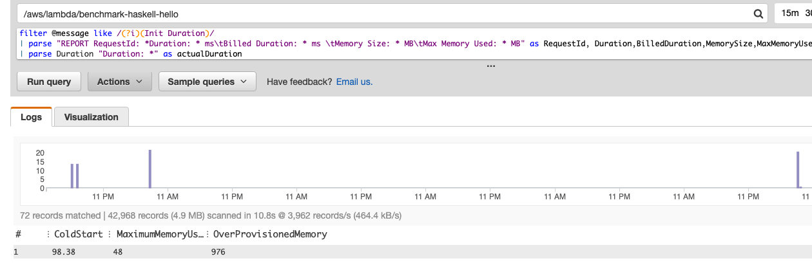

# aws-lambda-benchmark
A project that contains AWS Lambda function implementations for several runtimes e.g. Nodejs, Haskell, Python, Go, Rust, Java, etc.

- [Examples and Performance](#examples)
- [CloudWatch Dashboard Screenshots](#cloudwatch-dashboard-screenshots)
- [Manually Deploying Lambda function](#Manually-deploying-Lambda-functions)
- [Triggering your function through API Gateway](#Triggering-your-function-through-API-Gateway)
- [Using Artillery for testing](#Using-Artillery-for-testing)
- [Creating a Dashboard using AWS CloudWatch](#Creating-a-Dashboard-using-AWS-CloudWatch)
    - [Custom CloudWatch Dashboard Widgets](#Custom-CloudWatch-Dashboard-Widgets)

## Examples
[Hello World HOW-TO](examples/hello-world/setup.md)

|**Runtime**|**Best Cold Start**|**Worst Cold Start**|**execution time**|**Max memory used**|
|-------|---------------|----------------|------------------|---------|
|**Haskell**|60.30 ms|98.38 ms|0.86 ms|48 MB|
|**Java**|790 ms|**812 ms**|0.89 ms|109 MB|
|**Nodejs**|3.85 ms|43.8 ms| 0.26 ms|66 MB|
|**Go**|**1.39 ms**|7.60 ms|0.25 ms|48 MB|
|**Rust**|39.1 ms|58.7 ms|0.70 ms|**34 MB**|
|**Python**|15.9 ms|33.2 ms|0.22 ms|50 MB|
|**Ruby**|11.5 ms|--|1.42 ms|51 MB|
|**C# .NET 2.1**|631 ms|--|**0.17 ms**|83 MB|
|**F# .NET 2.1**|528 ms|--|0.22 ms|84 MB|

**Notes: 1024 MB of memory**

### CloudWatch Dashboard Screenshots
**19-06-2019** [Screenshot](assets/performance/hello-world/hello-world-19-06-19.png)
- Improvements in [Lambda Haskell Runtime](https://github.com/theam/aws-lambda-haskell-runtime/pull/30)
- Added Ruby 2.5, C# and F# .NET 2.1 to Benchmarks

**18-06-2019** [Screenshot](assets/performance/hello-world/hello-world-18-06-19.png)
- Improvements in [Lambda Haskell Runtime](https://github.com/theam/aws-lambda-haskell-runtime/pull/29)  

**17-06-2019** [Screenshot](assets/performance/hello-world/hello-world-17-06-19.png)
- Baseline

[CRUD HOW-TO](examples/rest-api/setup.md)


|**Runtime**|**Haskell**|**Java**|**Nodejs**|**Python**|**C# .NET 2.1**|**Go**|
|-----------|-----------|--------|----------|----------|---------------|------|
|**Create**|173 ms|6.40 ms|7.24 ms|6.28 ms|**4.75 ms**|--|
|**Get**|170 ms |6.13 ms|5.87 ms|4.29 ms|**3.56 ms**|--|
|**List**|150 ms|8.20 ms|9.25 ms|7.34 ms|**6.84 ms**|--|
|**APIGW worst latency**|10.80 s|14.10 s|**10.00 s**|10.60 s|11.80 s|--|
|**APIGW latency average**|248 ms|595 ms|**39 ms**|41.80 ms|186 ms|--|

### Notes:
- **API Gateway Latency** is the actual duration of the HTTP Request

**25-06-2019** [Screenshot](assets/performance/rest-api/rest-api-25-06-19.png)
- Baseline

---

## Manually deploying Lambda functions
We have avaliable a set of examples that will give you all the stuff required to get your function deployed in AWS.

For example, [this page](examples/hello-world/setup.md) gives you a step by step guide on how to deploy a Rust Lambda function.
The `Hello-World` code we used for benchmarking is [here](examples/hello-world)

## Triggering your function through API Gateway

First of all, we will need to create a few resources before we can trigger our Lambda Function. Go to `API Gateway` in the AWS Console.

- Create a new API, select `Rest` and from `New API` and choose a name for your API.
- Then create a `stage` named e.g. `dev`
- Create a `resource` named e.g. `nodejs-hello` and enable `CORS`
- Within that resource, create a `method` `GET`, enable `Use Lambda Proxy Integration` and type the name of your function under `Lambda Function`
- Finally click `save` and click `deploy` under the dropdown menu of `Actions`
- Your endpoint URL will be: <Method> <stage-invoke-url>/<resource-name>, e.g. GET https://0c9lfg7004.execute-api.us-east-1.amazonaws.com/dev/nodejs-hello

**If you experience 403 errors when triggering your endpoint, go to `Actions` and click `Deploy API`**

**Note: This API Gateway could be reused for many different Lambda functions by creating a `resource` for each of them**


## Using Artillery for testing

Install `serverless`, `artillery` and `serverless-artillery` if you don't have them yet

```bash
yarn global add serverless
yarn global add artillery
yarn global add serverless-artillery
```
or 
```bash
npm install --global serverless
npm install --global artillery
npm install --global serverless-artillery
```

### Manual Testing Approach
Run a quick test that will perform 10 rps per second during 10 seconds coming from 10 different sources each second

`artillery quick --duration 10 --rate 10 -n 1 https://0c9lfg7004.execute-api.us-east-1.amazonaws.com/dev/nodejs-hello`

### Automated Testing Approach
Go to the example artillery directory, e.g. `cd examples/hello-world/artillery`

and then run the following command:

`slsart invoke -p artillery-test.yml`

This will trigger a set requests for each of the languages we are currently benchmarking in the `hello-world` example.

## Creating a Dashboard using AWS CloudWatch
AWS CloudWatch is the service where you could find Analytics about your Lambda function. Information about execution time, # invocations, # errors or # throttles. Go to `AWS CloudWatch` in the AWS Console.

- Click on `Dashboards` and `Create Dashboard`
- Create the first `Widget` of type `Number`
- Select `Lambda` as the source for your metric
- Select `By Function Name`
- And click on all the metrics that you want to track for you would like to track e.g. `Duration`, `Errors`
- Click `Create Widget` and you will see the metrics being displayed


In this example, we selected the following metrics:


### Custom CloudWatch Dashboard Widgets



Custom Widgets can be created out of information extracted from Lambda Logs. These metrics are extracted through Queries, for example:
```bash
filter @message like /(?i)(Init Duration)/
| parse "REPORT RequestId: *Duration: * ms\tBilled Duration: * ms \tMemory Size: * MB\tMax Memory Used: * MB" as RequestId, Duration,BilledDuration,MemorySize,MaxMemoryUsed
| parse Duration "Duration: *" as actualDuration
| stats max(actualDuration) as ColdStart, max(MaxMemoryUsed) as MaximumMemoryUsed, max(MemorySize) - max(MaxMemoryUsed) as OverProvisionedMemory
```

The above example will perform the following actions:
- Filter logs that contain "Init Duration"
- Parse the logs and extract variables
- Parse the variable `Duration` to extract actual duration
- Display stats from variables